# 🩸 ABO

<p align="center">
  <b>A Mobile-First Blood Donation Platform</b><br>
  Connecting blood donors with hospitals through a simple, fast and reliable experience.
</p>

---

## ✨ Overview

ABO is a mobile-first application designed to simplify the blood donation process by connecting blood donors with hospitals and healthcare centers.

The platform supports **two-sided coordination** between donors and hospitals:

### 🩸 Donor → Hospital Flow

1. Donor registers and verifies identity (national ID + birth date + OTP)
2. Donor registers donation readiness (blood type, date, city)
3. Donor browses active blood requests by city
4. Donor selects a request and books an appointment (date → time → confirmation)
5. Hospital receives the appointment and confirms or rejects it
6. Donation is completed and recorded (triggers 3-month cooldown)

### 🏥 Hospital → Donor Flow

1. Hospital creates a blood request (type, units, urgency, deadline)
2. Compatible donors appear in the volunteers list
3. Hospital reviews volunteers and sends a personalized invitation
4. Donor receives the invitation and accepts or declines
5. On acceptance, appointment is created and a chat is opened
6. Hospital marks the donation as complete

### 🧩 Problem Statement

In many regions, blood donation systems are fragmented, slow, and lack real-time coordination between donors and hospitals. ABO was designed to solve this by providing a unified digital platform where hospitals can instantly publish needs and donors can respond in real time with minimal friction.

---

# 📱 Application Preview

## 🌐 Local Development

```text
Frontend:  http://localhost:5173
Backend:   http://localhost:3001
LAN:       http://<your-ip>:5173  (accessible on local network)
```

## 🔑 Demo Credentials

> All passwords: `12345678`

| Role     | Username                   | Description                          |
| -------- | -------------------------- | ------------------------------------ |
| Donor    | `1234567890` (creativeNationalId) | Test donor — احمد محمدی          |
| Donor    | `9876543210`              | Test donor — سارا رضایی              |
| Donor    | `5555555555`              | Test donor — علی حسینی               |
| Hospital | `TEH-1234`                | بیمارستان شریعتی — تهران             |
| Hospital | `TEH-5678`                | بیمارستان مدرس — تهران               |

---

## First Page

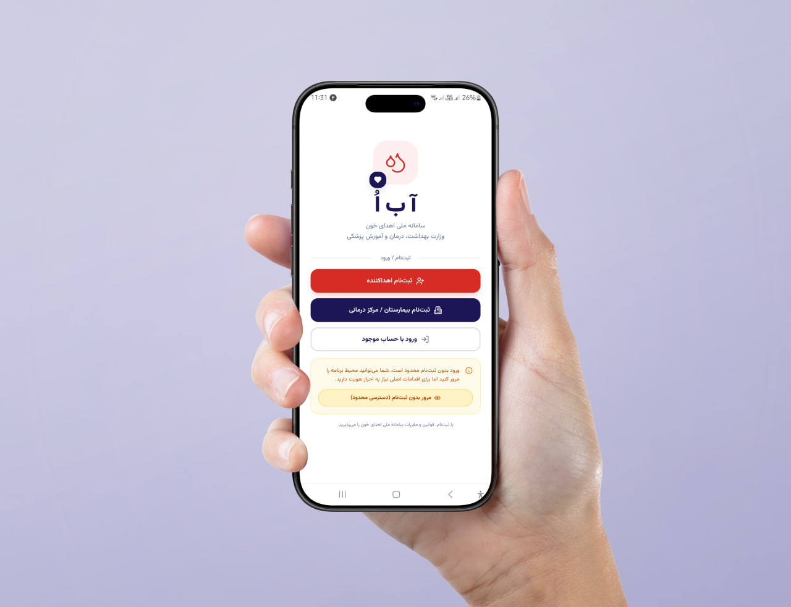

---

## Login

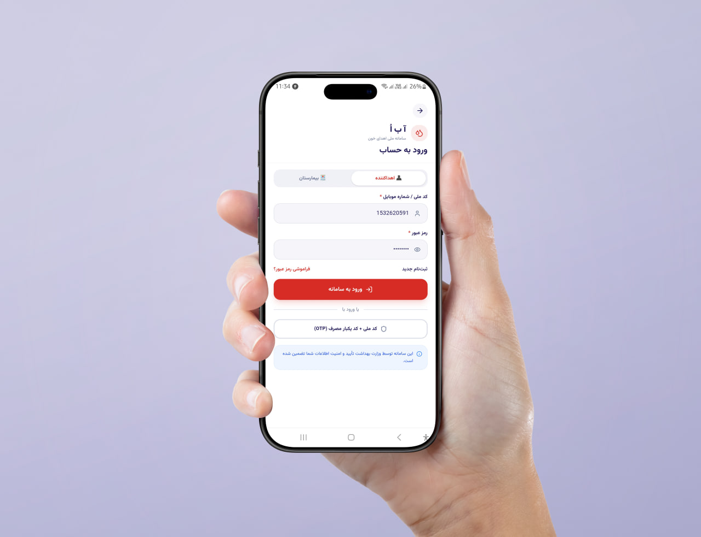

---

## Home (Donor)

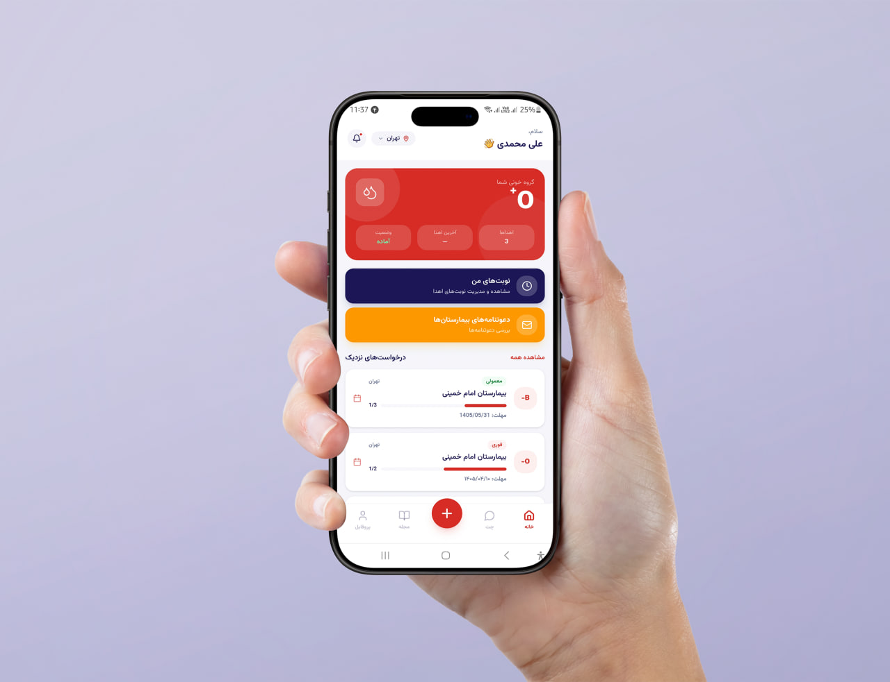

---

## Readiness Registration

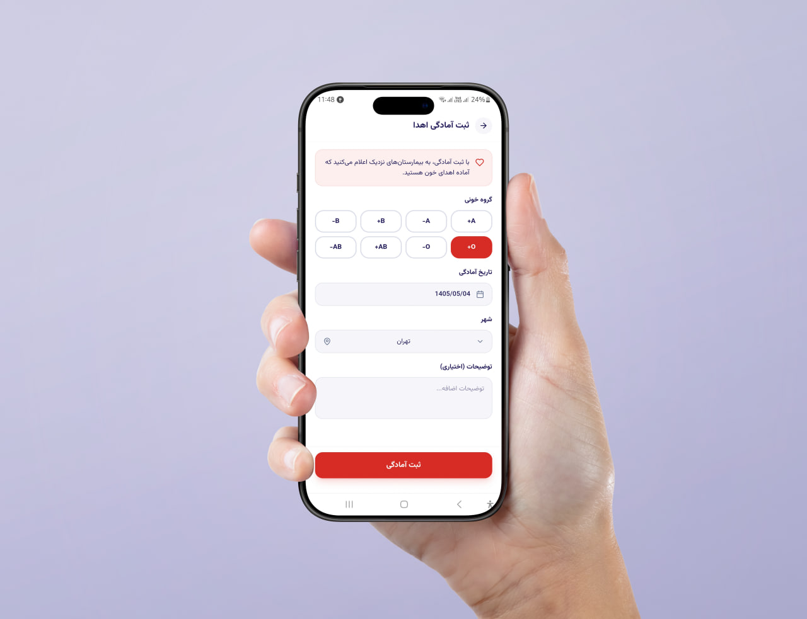

---

## Home (Hospital)

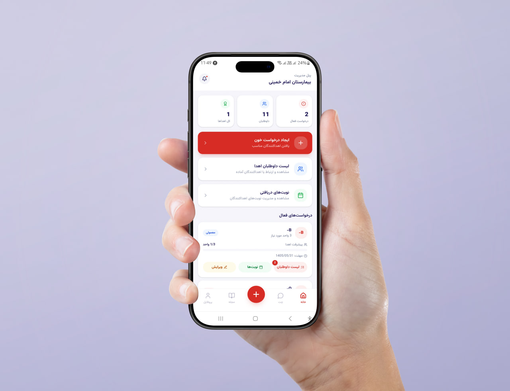

---

## Blood Request Details

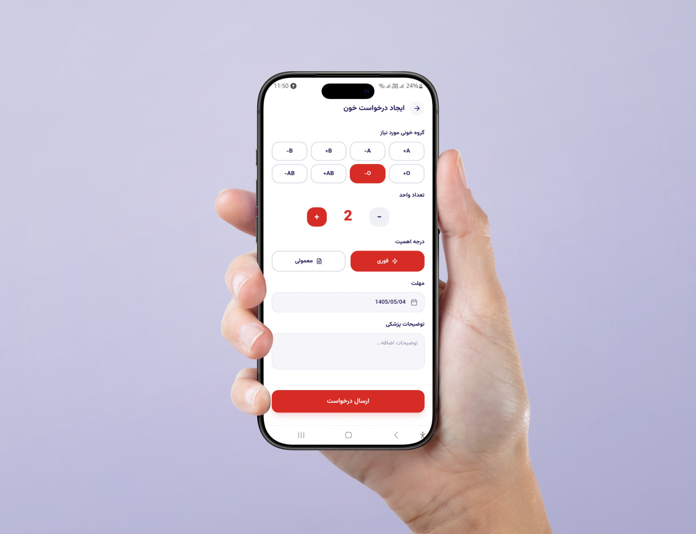

---

## Ready Donors (Volunteers)

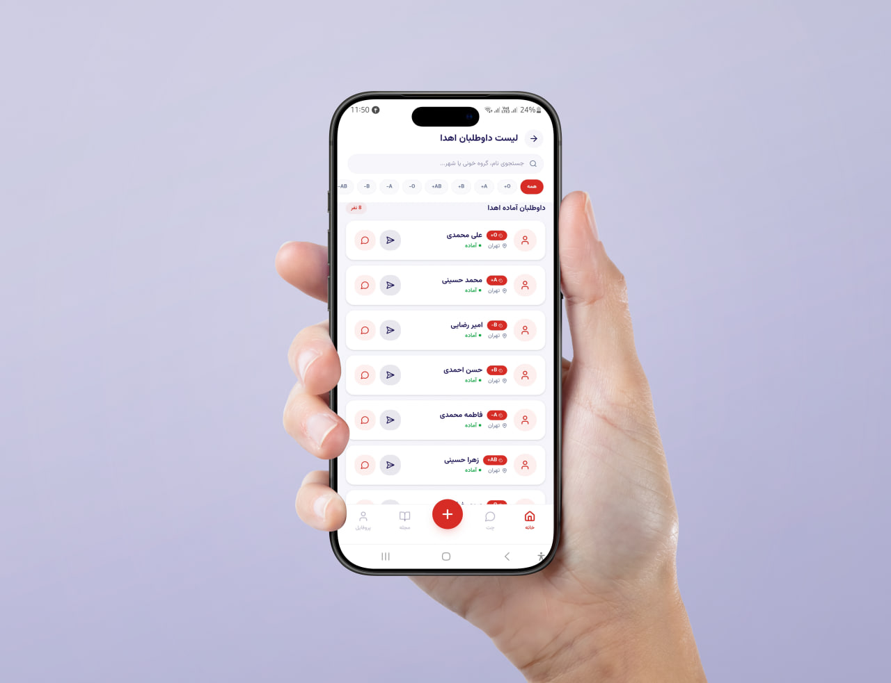

---

## Appointment Booking

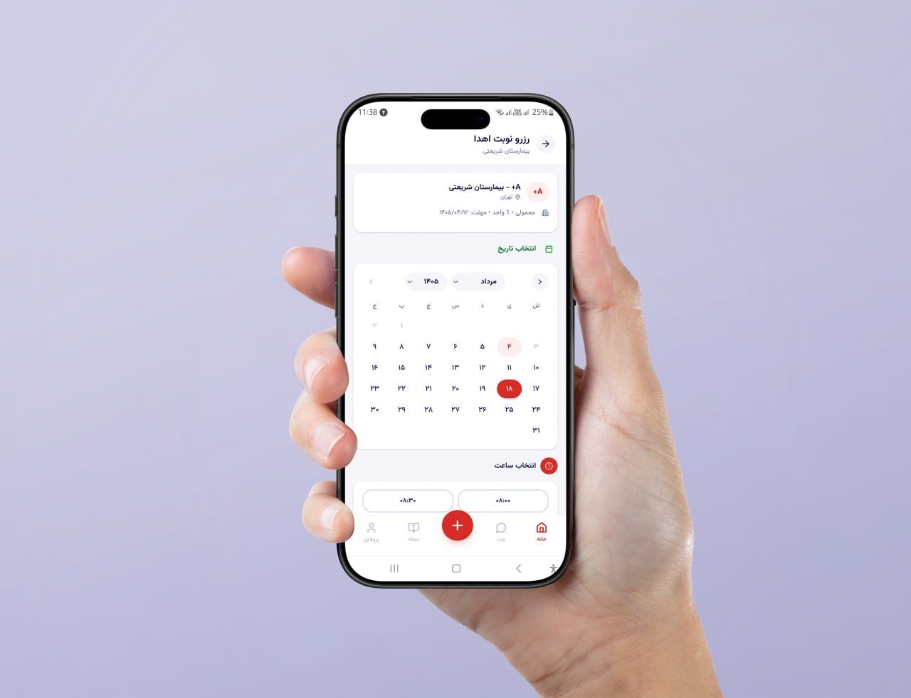

---

## Chat

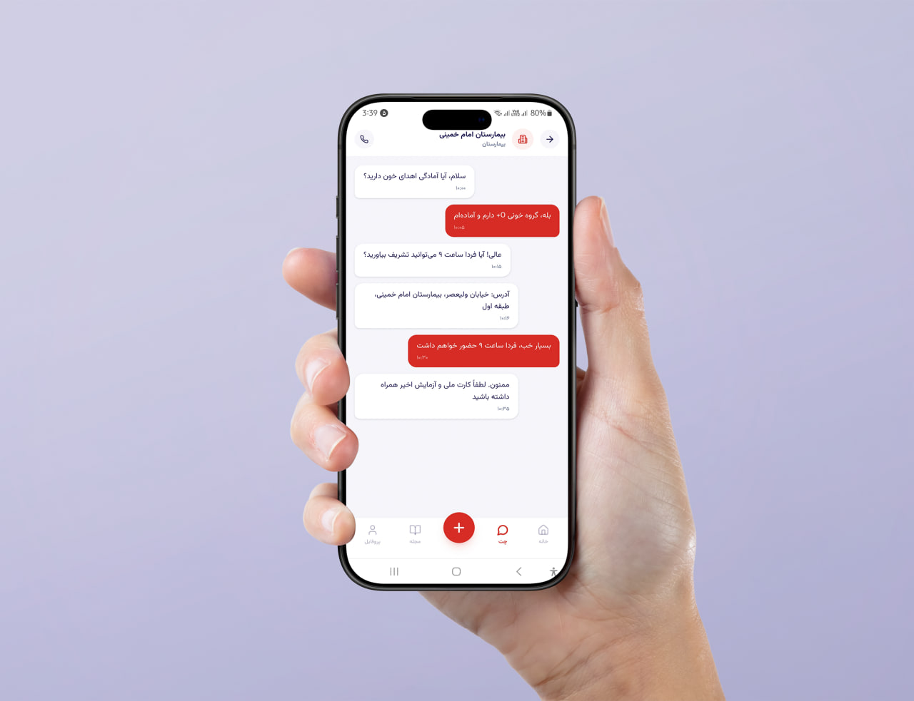

---

## Notifications

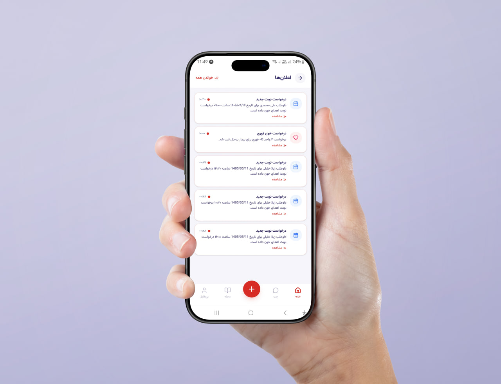

---

## Profile

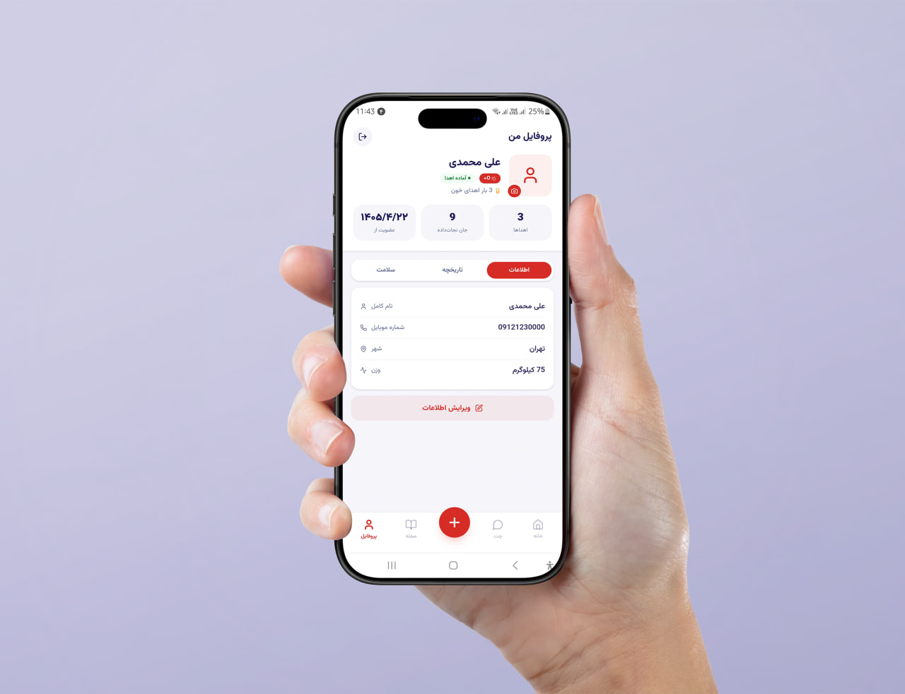

---

## Magazine

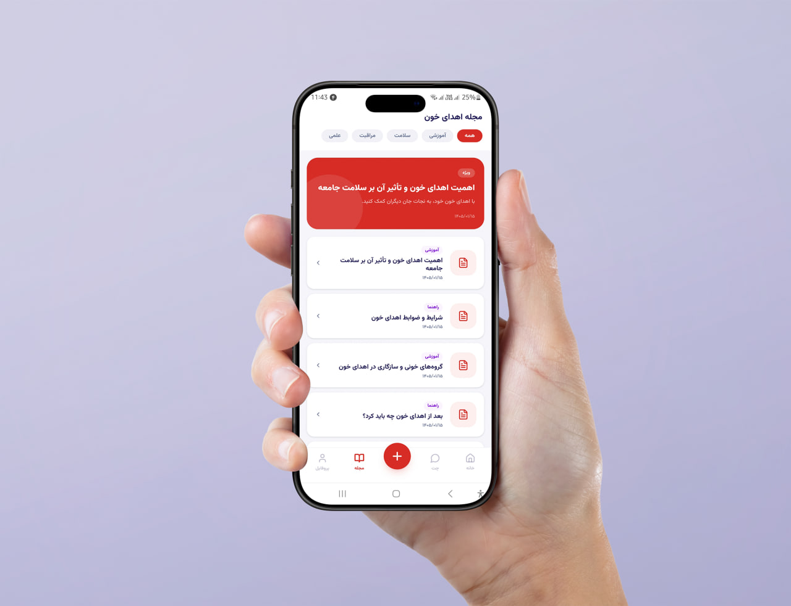

---

# 🚀 Features

* 🔐 Registration with OTP Verification & Password Strength Meter
* 👤 Role-based Access (Donor / Hospital dashboards)
* 🩸 Blood Request Management (create, browse, match)
* 📍 City-based Request Discovery (provinces-first city selector)
* 📅 Appointment Booking with Bottom Sheet Confirmation & Countdown
* 💬 Donor–Hospital Real-time Messaging with Notifications
* 📖 Educational Magazine (articles & health tips)
* 👨🏻‍⚕️ Health Profile Management (eligibility, readiness)
* 🔔 Smart Notifications (clickable, linked to related entities)
* 🏥 Hospital-Initiated Donor Invitations (send → accept/reject → chat)
* 🩸 Donor-Initiated Appointment Booking (browse → book → hospital confirms)
* 🏛️ National Registry Integration (donors & hospitals)
* 🗃️ Persistent Backend Database (Express + SQLite)
* 📱 Mobile-Optimized UI (always-visible bottom toolbar, max-width 430px)

---

# 🏗 Tech Stack

| Technology               | Description            |
| ------------------------ | ---------------------- |
| ⚛️ React                 | Front-end Framework    |
| 🟦 TypeScript            | Type Safety            |
| ⚡ Vite                   | Build Tool             |
| 🎨 Tailwind CSS          | Styling                |
| 🖥️ Express              | Backend API Server     |
| 🗄️ sql.js (SQLite WASM) | Database Engine        |
| 🔁 concurrently          | Dev Mode Orchestration |

---

# 📂 Project Structure

```text
src/
├── app/
│   ├── components/
│   │   └── ui/
│   ├── contexts/
│   ├── data/
│   ├── lib/
│   ├── screens/
│   ├── services/
│   └── types/
├── backend/
│   ├── routes/
│   ├── db.ts
│   ├── seed.ts
│   └── server.ts
├── styles/
│   ├── fonts.css
│   ├── globals.css
│   ├── index.css
│   ├── tailwind.css
│   └── theme.css
├── assets/
└── main.tsx
public/
└── fonts/           (Vazirmatn woff2 local font files)
```

---

# ⚙️ Getting Started

## Install dependencies

```bash
npm install
```

## Run development server (frontend + backend)

```bash
npm run dev:all
```

## Run backend only

```bash
npm run server
```

## Run frontend only

```bash
npm run dev
```

## Build production

```bash
npm run build
```

---

# 🗄️ Backend API

The Express backend runs on port `3001` and exposes the following API modules under `/api/`:

| Module           | Routes                                        | Description                          |
| ---------------- | --------------------------------------------- | ------------------------------------ |
| `/api/auth`      | login, register, logout, session, OTP send/verify, password recovery | Authentication & account management  |
| `/api/donors`    | profile CRUD, notifications                   | Donor-specific operations            |
| `/api/hospitals` | profile CRUD, listing toggle                  | Hospital-specific operations         |
| `/api/requests`  | blood requests, appointments, invitations  | Request & appointment lifecycle, donor invitations |
| `/api/chats`     | conversations, messages                       | Messaging between donors & hospitals |
| `/api/magazine`  | articles, categories                          | Educational content                  |
| `/api/registry`  | national donor & hospital registry            | Government registry integration      |

---

# 👥 User Roles

## 🩸 Donor

### Registration & Profile
* Register with national ID + birth date + phone verification (OTP)
* Password strength meter (digits only → digits+letters → mixed case → with symbols)
* Manage health profile, eligibility status, and donation history

### Donor → Hospital (Browse & Book)
* Browse active blood requests by city (provinces-first city selector)
* View request details (blood type, hospital, urgency, units, deadline)
* Book an appointment: select date (Persian calendar) → select time slot → bottom sheet confirmation
* Auto-cancel other appointments for the same request on booking
* View appointment timeline with visual stepper (Book → Confirmed → Donate → Complete)

### Donor Responses to Hospital
* View hospital invitations with accept/reject actions
* On accept: appointment is created, chat is opened, toast confirmation
* On reject: invitation is dismissed with confirmation
* View "My Appointments" with status timeline and waiting time

### Donor Communication
* Chat with hospitals (real-time messaging)
* Receive clickable notifications linked to appointments, invitations, and messages
* Notification badge on home screen for unread count

---

## 🏥 Hospital

### Registration & Profile
* Register with hospital license
* Manage profile, toggle public listing

### Hospital → Donor (Request & Invite)
* Create blood requests (type, units, urgency, deadline, notes)
* Edit active requests (units, urgency, deadline)
* Cancel requests (auto-cancels all related appointments)
* View compatible volunteers list with search and blood type filter
* Send personalized invitations to donors (select request → date → time slot)
* Invitation includes donor name, blood type, and appointment details

### Hospital Appointment Management
* Receive donor-initiated appointments (from booking)
* View all appointments in 4 sections:
  * **Needs Confirmation** — pending donor bookings
  * **Awaiting Volunteer Response** — sent invitations pending donor reply
  * **Confirmed** — accepted appointments (expandable: complete or cancel)
  * **History** — completed and cancelled appointments
* Confirm or reject pending appointments
* Mark donations as complete (triggers donor 3-month cooldown)
* Cancel confirmed appointments

### Hospital Communication
* Chat with donors (from volunteer list or after appointment booking)
* Receive clickable notifications for new appointments and messages
* Dashboard with stats (active requests, volunteers, completed donations)

---

# 🗺 Roadmap

* ✅ Authentication & OTP Verification
* ✅ Role-based UI
* ✅ Blood Requests (hospital-created, donor-browsable)
* ✅ Donor Appointment Booking (browse → book → hospital confirms)
* ✅ Hospital Donor Invitations (volunteer list → invite → donor accepts)
* ✅ Appointment Management (confirm, reject, complete, cancel)
* ✅ Database Integration (Express + SQLite)
* ✅ Magazine & Article System
* ✅ National Registry Management
* ✅ Notifications System (clickable, entity-linked)
* ✅ Real-time Donor–Hospital Messaging
* ✅ 3-Month Donation Cooldown & Auto-Cancel
* ⏳ Smart Donor Matching (AI/ML)
* ⏳ Deployment & CI/CD
